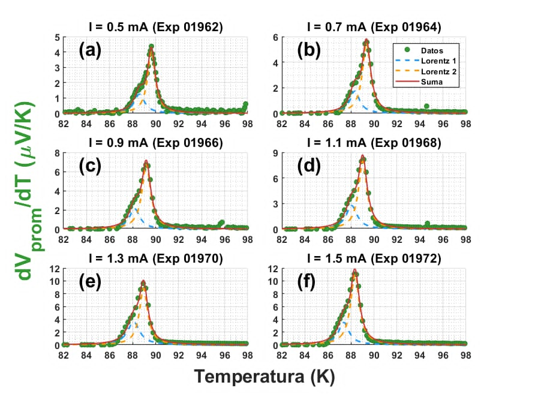
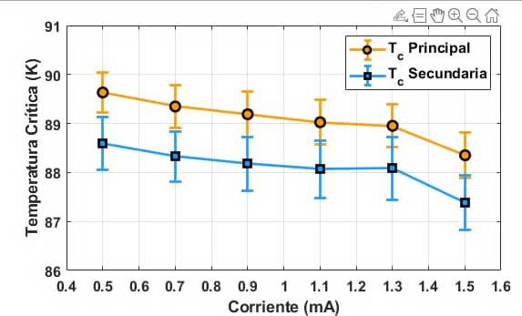
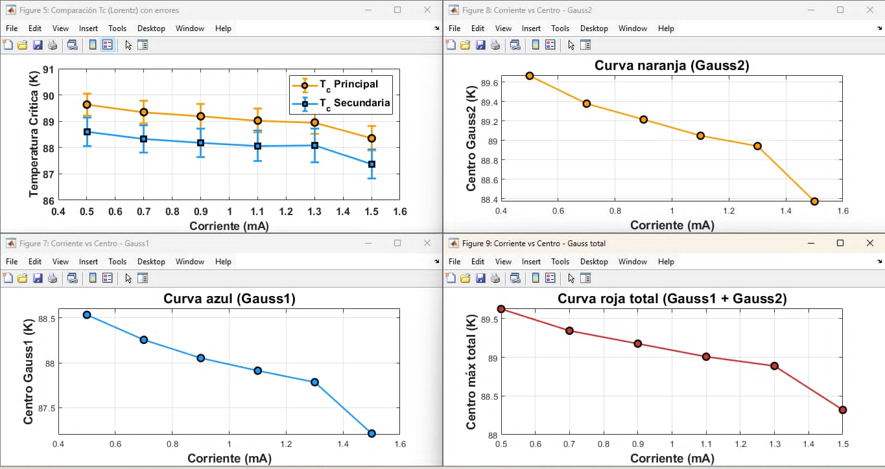
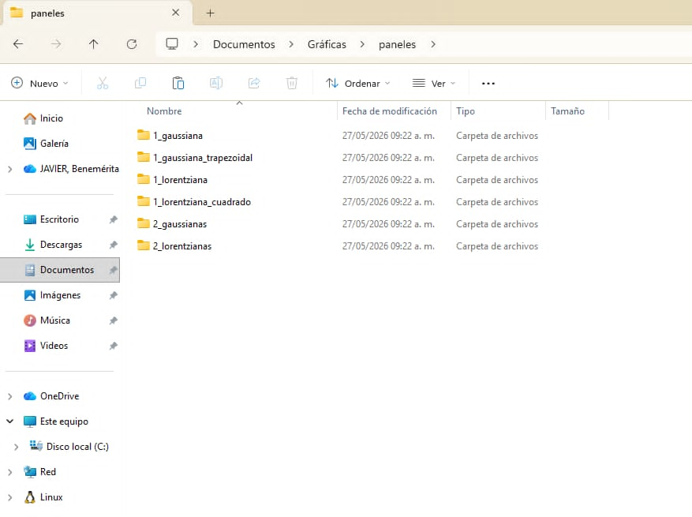

# superconductor-data-analysis-matlab

MATLAB toolkit for automated processing, fitting, and statistical analysis of superconducting experimental data.

This project analyzes voltage derivative measurements (`dV/dT`) obtained from superconducting experiments under different applied currents.
The software performs Lorentzian and Gaussian fitting, extracts critical temperatures, computes statistical trends, and generates publication-style plots for scientific analysis.

---

# Features

* Automated processing of superconducting experimental datasets
* Lorentzian peak fitting
* Gaussian decomposition analysis
* Critical temperature extraction
* Error bar visualization
* Statistical comparison between experiments
* Multi-panel scientific plotting
* Automated graph generation
* MATLAB-based numerical analysis
* Experimental current vs temperature analysis

---

# Technologies Used

* MATLAB
* Numerical Methods
* Scientific Computing
* Data Analysis
* Nonlinear Curve Fitting
* Statistical Modeling
* Experimental Physics

---

# Project Structure

```text
superconductor-data-analysis-matlab
│
├── screenshots/
│
├── Run0_01962.Cn1
├── Run0_01962.Cn2
├── Run0_01964.Cn1
├── Run0_01964.Cn2
├── Run0_01966.Cn1
├── Run0_01966.Cn2
├── Run0_01968.Cn1
├── Run0_01968.Cn2
├── Run0_01970.Cn1
├── Run0_01970.Cn2
├── Run0_01972.Cn1
├── Run0_01972.Cn2
│
├── analysis_superconductor_data.m
└── README.md
```

---

# Experimental Data Processing

The script processes multiple superconducting experimental runs measured at different current values.

Each experiment contains:

* temperature measurements
* voltage derivative signals (`dV/dT`)
* superconducting transition peaks

The software automatically:

* imports experimental files
* normalizes datasets
* applies Lorentzian/Gaussian fitting
* extracts peak centers
* computes critical temperature trends

---

# Lorentzian Analysis

The project performs double Lorentzian fitting to analyze superconducting transition behavior and identify multiple transition components.

## Lorentzian Fit Results



---

# Critical Temperature vs Current

The software computes the evolution of critical temperature (`Tc`) as the applied current increases.

The generated plots include:

* statistical uncertainty
* error bars
* comparison between primary and secondary transition peaks

## Tc vs Current



---

# Gaussian Decomposition Analysis

The project also performs Gaussian decomposition analysis to compare fitting models and evaluate superconducting peak behavior.

## Gaussian Fit Results



---

# Automated Result Export

The analysis generates organized result panels and exported graphical outputs automatically.

## Generated Analysis Panels



---

# Numerical Analysis Workflow

The MATLAB workflow includes:

1. Experimental data import
2. Signal preprocessing
3. Peak fitting
4. Parameter extraction
5. Statistical analysis
6. Error estimation
7. Scientific visualization
8. Automated figure generation

---

# Running the Project

## 1. Clone the repository

```bash
git clone https://github.com/AdrielHa/superconductor-data-analysis-matlab.git
```

---

## 2. Open MATLAB

Open MATLAB and navigate to the project directory.

---

## 3. Run the analysis script

Execute:

```matlab
analysis_superconductor_data
```

The script will automatically:

* load datasets
* process measurements
* generate plots
* perform fitting analysis

---

# Scientific Applications

This project can be used for:

* superconductivity analysis
* experimental condensed matter physics
* transition temperature studies
* nonlinear fitting analysis
* scientific data visualization
* statistical signal analysis

---

# Learning Objectives

This project was developed to practice:

* Scientific computing with MATLAB
* Numerical data analysis
* Experimental physics processing
* Lorentzian and Gaussian fitting
* Statistical visualization
* Automated graph generation
* Scientific programming workflows

---

# Author

Adriel Yulissa Hernández Albarrán

Background in Physics with experience in:

* Scientific computing
* Numerical modeling
* Experimental data analysis
* Computational physics
* Data visualization
* Backend development
* Statistical analysis
